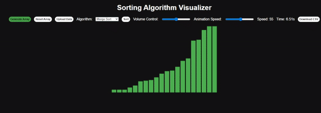

# Sorting Algorithm Visualizer

An interactive, sorting algorithm visualizer built to show how common sorting algorithms work through animated bars and sounds.

🔗 **Live Demo:**  

[https://nickd456.github.io/Sorting-Algorithm-Visualizer/](https://nickd456.github.io/Sorting-Algorithm-Visualizer/)

---

## ✨ Features

- Visualizes multiple sorting algorithms step by step
- Adjustable animation speed
- Audio feedback based on data values
- Upload custom datasets via **CSV or Excel**
- Export sorted results as a **CSV file**
- Execution timer for algorithm comparisons 
- Clean, modular JavaScript set up

---

## 📊 Supported Algorithms

- Bubble Sort  
- Selection Sort  
- Insertion Sort  
- Merge Sort  
- Quick Sort  
- Heap Sort  

Each algorithm is animated to show comparisons, swaps, and movement.

---

## 📁 Data Input & Output

### Upload Data
Users can upload custom datasets using:
- `.csv`
- `.xlsx`
- `.xls`

Only numeric values are parsed.

### Download Results
After sorting, users can download the sorted data as a CSV file.

---

## 🔊 Audio Visualization

Each comparison plays a short tone whose pitch corresponds to the value.  
Volume can be adjusted or muted using the volume slider.

---

## 🛠️ Tech Stack

- **HTML5**
- **CSS**
- **JavaScript**
- **Web Audio API**
- **FileReader API**
- **SheetJS (XLSX parsing)**

---

## 🧠 Project Structure

- `Sorting-Algorithm-Visualizer`
  - `index.html` – Main HTML
  - `style.css` – Styling
  - `main.js` – State & event handling
  - `ui.js` – Rendering & visual updates
  - `sorting.js` – Sorting algorithms
  - `audio.js` – Sound generation
  - `data.js` – File parsing
  - `README.md`

---

## 👤 Author

**Nicholas Decinto**  
Interactive Media & Game Design  
Computer Science Minor  

🔗 Portfolio: [https://nickd456.github.io/Portfolio/](https://nickd456.github.io/Portfolio/)  
🔗 LinkedIn: [https://www.linkedin.com/in/nick-decinto/](https://www.linkedin.com/in/nick-decinto/)

---

### ⭐ If you found this useful, feel free to star the repo!
